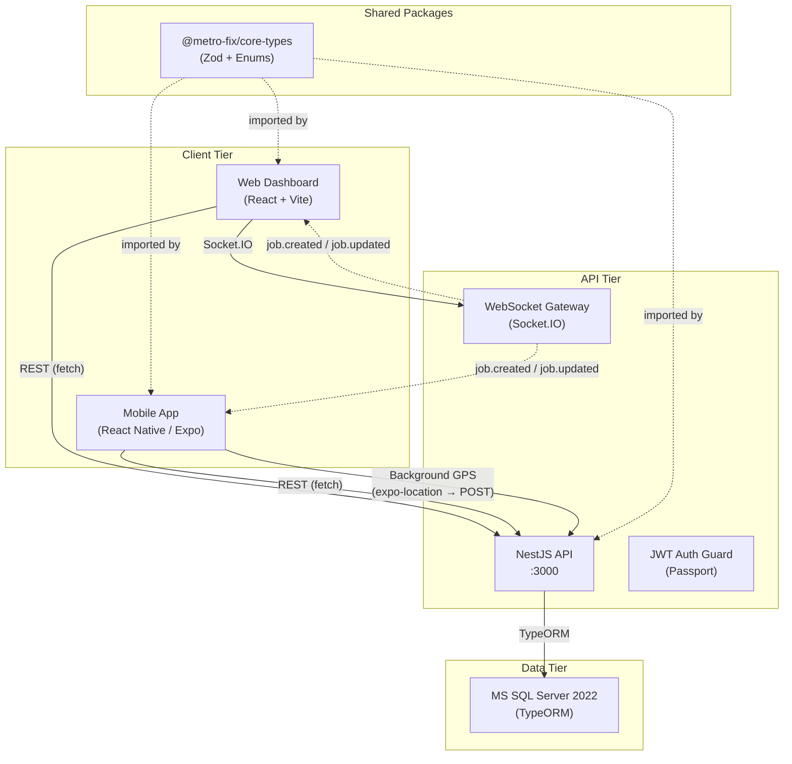
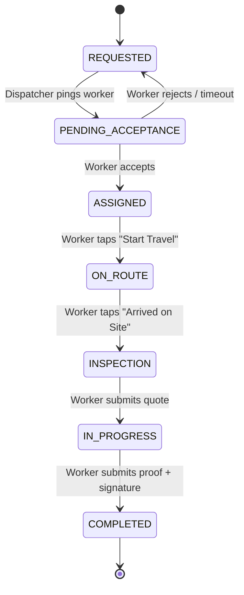
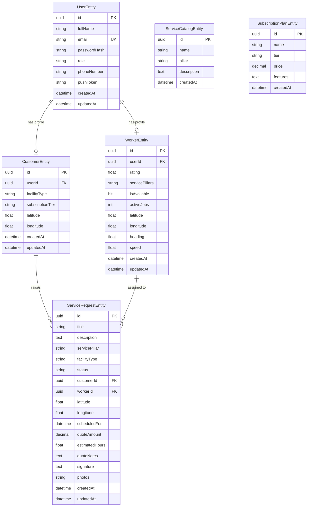

# METRO-FIX Platform — Final Project Summary

> **Managed Dispatch Facility Management Platform**
> Built by EMTEK Engineering · Monorepo v0.1.0

---

## 1. Product Vision

### The Problem

Facility maintenance — HVAC, plumbing, electrical, janitorial — operates on phone calls, paper job sheets, and manual coordination. A property manager discovers a broken chiller, calls a service company, waits for a callback, and has no visibility into when (or whether) a technician is actually en route. The service company, in turn, dispatches workers by gut feel, has no real-time view of field positions, and collects proof-of-work on carbon-copy forms that arrive days late.

### The Solution

**METRO-FIX** is a centralized-dispatch, field-execution platform — an "Uber for facility maintenance" with a human dispatcher in the loop. It connects three actors through a single real-time system:

| Actor | Interface | Core Action |
|---|---|---|
| **Customer** | Mobile App (React Native) | Raises service requests; tracks technician en route; signs off on completed work |
| **Customer Care / Dispatcher** | Web Dashboard (React + Vite) | Views all tickets on a Kanban board; dispatches the optimal worker by proximity × rating; monitors the fleet |
| **Field Technician (Worker)** | Mobile App (React Native) | Receives assignments; navigates to site; submits on-site quotes; captures photo proof; obtains digital customer signature |

The platform covers three **Facility Types** (Residential, Commercial, Industrial), three **Service Pillars** (Hard, Soft, Strategic), and three **Subscription Tiers** (Basic, Plus, Premium) — giving the business a flexible pricing and entitlement model from day one.

---

## 2. Architecture Map

### 2.1 Monorepo Layout (Turborepo)

```
metrofix-root/
├── apps/
│   ├── api/          ← NestJS backend (REST + WebSocket)
│   ├── web/          ← React + Vite admin dashboard
│   └── mobile/       ← React Native (Expo) field app
├── packages/
│   ├── core-types/   ← Shared enums, Zod schemas, TS interfaces
│   ├── ui/           ← Shared React components & brand assets
│   └── ts-config/    ← Shared tsconfig base configs
├── .github/workflows/build.yml  ← CI pipeline (Node 22)
├── compose.yml       ← Docker Compose (MSSQL + API + Web)
└── turbo.json        ← Turborepo build orchestration
```

### 2.2 Communication Diagram



### 2.3 Technology Stack

| Layer | Technology | Purpose |
|---|---|---|
| **Build System** | Turborepo, Node 22, NPM 9 | Monorepo orchestration, parallel builds |
| **Backend** | NestJS 11 | REST API, WebSocket gateway, Zod validation pipes |
| **Database** | MS SQL Server 2022 via TypeORM | Relational persistence, `synchronize: true` in dev |
| **Auth** | Passport JWT, bcrypt | Stateless token auth, hashed passwords |
| **Web Frontend** | React 19, Vite 6, `@hello-pangea/dnd` | Kanban board, data grids, RBAC route guards |
| **Mobile** | React Native 0.85, Expo SDK | Field technician & customer interfaces |
| **GPS Telemetry** | expo-location, expo-task-manager | Background location streaming while ON_ROUTE |
| **Camera / Signature** | expo-image-picker, react-native-signature-canvas | Photo proof capture, customer digital sign-off |
| **Real-time** | Socket.IO (via `@nestjs/websockets`) | Broadcast `job.created` / `job.updated` events |
| **Shared Types** | `@metro-fix/core-types` (Zod + TypeScript) | Single source of truth for enums, schemas, DTOs |
| **CI** | GitHub Actions | Build & typecheck on push/PR to main |
| **Containerization** | Docker Compose | MSSQL + API + Web dev stack |

---

## 3. The Completed Core Loop — 7-Stage Service Ticket Lifecycle

Every service request in METRO-FIX follows a strict, linear state machine. Below is the complete mapping of **who does what, where, and how the state change propagates** across the system.



### Stage-by-Stage Breakdown

#### Stage 1 → `REQUESTED`

| Aspect | Detail |
|---|---|
| **Trigger** | Customer submits a service request via the Mobile App (`CustomerBookingWizard`) or via the Web Dashboard |
| **API** | `POST /jobs` → `JobsService.createJob()` |
| **Web UI** | Ticket appears in the **"Requested"** column of the Kanban board |
| **Mobile** | Confirmation shown to customer; ticket visible in customer tracking view |
| **WebSocket** | `job.created` event broadcast to all connected clients |

#### Stage 2 → `PENDING_ACCEPTANCE`

| Aspect | Detail |
|---|---|
| **Trigger** | Dispatcher selects a worker from the **Assign Worker** modal on the Web Kanban card |
| **API** | `PATCH /jobs/:id/status` with `{ status: 'PENDING_ACCEPTANCE', workerId }` |
| **Backend Logic** | Verifies worker exists; attaches `workerId` to the ticket |
| **Web UI** | Card moves to **"Pending Acceptance"** column; shows assigned worker name |
| **Mobile** | `NewJobAlertModal` fires on the worker's device with accept/reject actions |
| **Fallback** | If rejected or ignored → auto-reverts to `REQUESTED`, `workerId` nullified |

#### Stage 3 → `ASSIGNED`

| Aspect | Detail |
|---|---|
| **Trigger** | Worker taps **Accept** on the dispatch alert modal (`NewJobAlertModal`) |
| **API** | `PATCH /jobs/:id/assign` with `{ workerId }` → `JobsService.assignWorker()` |
| **Web UI** | Card moves to **"Assigned"** column |
| **Mobile** | Job appears in the `WorkerDashboard` FlatList; tapping opens `JobDetail` |

#### Stage 4 → `ON_ROUTE`

| Aspect | Detail |
|---|---|
| **Trigger** | Worker taps **"🚀 Start Travel (ON ROUTE)"** button on `JobDetail` screen |
| **API** | `PATCH /jobs/:id/status` with `{ status: 'ON_ROUTE' }` |
| **GPS Telemetry** | `startWorkerBackgroundTracking()` fires: requests foreground + background location permissions, registers `BACKGROUND_LOCATION_TASK` via `expo-task-manager`, begins streaming `{ lat, lng, heading, speed }` to `POST /workers/me/location` every 10 seconds |
| **Backend** | `WorkersService.updateWorkerLocation()` persists coordinates on `WorkerEntity` |
| **Web UI** | Card moves to **"On Route"** column; dispatcher sees live worker position |
| **Mobile** | GPS badge shows "Active Telemetry Streaming"; **"📍 Open Site in Native Maps"** button available for turn-by-turn navigation |

#### Stage 5 → `INSPECTION`

| Aspect | Detail |
|---|---|
| **Trigger** | Worker taps **"🏁 Arrived on Site (INSPECTION)"** button on `JobDetail` screen |
| **API** | `PATCH /jobs/:id/status` with `{ status: 'INSPECTION' }` |
| **GPS Telemetry** | `stopWorkerBackgroundTracking()` fires → unregisters background task → preserves device battery |
| **Web UI** | Card moves to **"Inspection"** column |
| **Mobile** | `JobDetail` renders the **On-Site Quote & Estimate** form (cost, hours, notes) |

#### Stage 6 → `IN_PROGRESS`

| Aspect | Detail |
|---|---|
| **Trigger** | Worker fills in the quote form and taps **"⚡ Submit Quote & Start Work"** |
| **API** | `POST /jobs/:id/quote` with `{ estimatedCost, estimatedHours, notes }` → `JobsService.submitJobQuote()` |
| **Backend** | Saves `quoteAmount`, `estimatedHours`, `quoteNotes` on `ServiceRequestEntity`; transitions status to `IN_PROGRESS` |
| **Web UI** | Card moves to **"In Progress"** column; quote amount visible |
| **Mobile** | `JobDetail` renders the **Complete Job Proof & Sign-Off** workflow: camera capture + signature canvas |

#### Stage 7 → `COMPLETED`

| Aspect | Detail |
|---|---|
| **Trigger** | Worker captures photo(s) with device camera, customer signs on the signature canvas, and worker taps **"✅ Submit Proof & Complete Job"** |
| **API** | `POST /jobs/:id/proof` with `{ signature: <base64>, photos: [<base64>, ...] }` → `JobsService.submitJobProof()` |
| **Backend** | Saves `signature` and `photos` array on `ServiceRequestEntity`; transitions status to `COMPLETED` |
| **Web UI** | Card moves to **"Completed"** column; full ticket lifecycle closed |
| **Mobile** | `JobDetail` shows the **"🎉 Ticket Finished"** completion card with final quote amount |
| **WebSocket** | Final `job.updated` event broadcast — all dashboards reflect the closure in real time |

---

## 4. API Endpoint Reference

### Auth (`/auth`)
| Method | Path | Auth | Description |
|---|---|---|---|
| `POST` | `/auth/login` | Public | JWT login (email + password) |
| `GET` | `/auth/me` | JWT | Get current user profile |
| `PATCH` | `/auth/profile` | JWT | Update user profile |

### Jobs (`/jobs`)
| Method | Path | Auth | Description |
|---|---|---|---|
| `GET` | `/jobs` | JWT | List all service requests |
| `GET` | `/jobs/:id` | JWT | Get single service request |
| `POST` | `/jobs` | JWT | Create new service request |
| `PATCH` | `/jobs/:id/status` | JWT | Transition job status |
| `PATCH` | `/jobs/:id/assign` | JWT | Assign worker to job |
| `POST` | `/jobs/:id/quote` | JWT | Submit on-site quote (→ IN_PROGRESS) |
| `POST` | `/jobs/:id/proof` | JWT | Submit proof + signature (→ COMPLETED) |

### Workers (`/workers`)
| Method | Path | Auth | Description |
|---|---|---|---|
| `GET` | `/workers` | JWT | List all workers |
| `GET` | `/workers/:id` | JWT | Get single worker |
| `POST` | `/workers` | JWT | Create worker profile |
| `GET` | `/workers/me/jobs` | JWT | Get jobs assigned to authenticated worker |
| `POST` | `/workers/me/location` | JWT | Update worker GPS telemetry |
| `GET` | `/workers/dispatch-search` | JWT | Find available workers by proximity for a job |
| `POST` | `/workers/ping` | JWT | Ping all workers (dispatch notification) |

### Users (`/users`)
| Method | Path | Auth | Description |
|---|---|---|---|
| `POST` | `/users` | JWT | Create user (admin worker provisioning) |
| `POST` | `/users/me/push-token` | JWT | Register FCM/Expo push token |

### Services & Subscriptions
| Method | Path | Auth | Description |
|---|---|---|---|
| `POST` | `/services` | JWT | Create service catalog entry |
| `POST` | `/subscriptions` | JWT | Create subscription plan tier |
| `GET` | `/financials/export` | JWT | Export financial report (CSV) |

---

## 5. Database Schema (TypeORM Entities)



---

## 6. Technical Debt & Scaling Roadmap

The following items were implemented as MVP shortcuts during the initial development sprint and **must** be addressed before production deployment.

### 🔴 Critical (Pre-Launch Blockers)

- **Photo Storage**: Proof-of-work photos are currently stored as Base64 strings directly in the `ServiceRequestEntity.photos` column. This will bloat the database rapidly. **Migrate to Azure Blob Storage / AWS S3** with presigned upload URLs; store only the object key/URL in the database.
- **Signature Storage**: Same problem as photos — the digital signature is a raw Base64 `data:image/png` string in the `signature` column. Offload to object storage.
- **CORS Wildcard**: `app.enableCors({ origin: '*' })` and the WebSocket gateway use `origin: '*'`. Lock down to specific domains before deployment.
- **JWT Secret Management**: The JWT signing secret should be externalized to a vault (Azure Key Vault / AWS Secrets Manager), not hardcoded or in a `.env` file.
- **`synchronize: true` in Production**: TypeORM's `synchronize` flag is enabled in non-production environments. This must be **disabled** in production and replaced with a proper migration strategy (`typeorm migration:generate`).
- **Input Sanitization**: Base64 payloads on `POST /jobs/:id/proof` are not size-limited. Add `express-filesize` middleware or NestJS interceptors to cap request body size (~10MB).

### 🟡 High Priority (Scale & Reliability)

- **PostGIS / Geography Types**: Worker and job coordinates currently use `float` columns. Migrating to PostGIS (PostgreSQL) or SQL Server `geography` types enables native spatial indexing, proper haversine distance queries, and `ST_DWithin` geofencing — critical for the dispatch proximity algorithm at scale.
- **WebSocket Authentication**: The `JobsGateway` currently accepts all Socket.IO connections without verifying the JWT. Add a `WsGuard` or connection middleware that validates the auth token on `handleConnection`.
- **Push Notifications (FCM)**: The `POST /users/me/push-token` endpoint stores the Expo/FCM token but **no push notification service is implemented yet**. Wire Firebase Cloud Messaging to send real dispatch alerts to workers instead of relying on in-app polling or the simulated `NewJobAlertModal`.
- **Role-Based API Guards**: API endpoints are protected by `JwtAuthGuard` (authentication) but **not by role**. A `CUSTOMER` can currently call `POST /workers` or `PATCH /jobs/:id/assign`. Add `@Roles(Role.ADMIN, Role.CUSTOMER_CARE)` decorator + `RolesGuard` to all sensitive endpoints.
- **Database Connection Pooling**: Configure TypeORM's connection pool (`extra.pool`) for production load; currently using default single-connection settings.
- **Rate Limiting**: Add `@nestjs/throttler` to protect login and GPS telemetry endpoints from abuse.

### 🟢 Medium Priority (Quality & DX)

- **React Native Navigation**: The mobile app currently manages screens via state toggles (`selectedJobForDetail`, `appRoleMode`). Migrate to `@react-navigation/native` with a proper stack + tab navigator for deep linking, gesture-based back navigation, and screen-level analytics.
- **API Response Standardization**: Some endpoints return raw TypeORM entities (with eager-loaded relations) while others return shaped DTOs. Standardize all responses through NestJS interceptors that strip internal fields (password hashes, internal IDs).
- **Error Handling Middleware**: Add a global NestJS exception filter that returns consistent `{ statusCode, message, error }` JSON for all HTTP errors, including Zod validation failures.
- **Test Coverage**: Currently only `entities.spec.ts` exists. Add unit tests for `JobsService` (state machine transitions, guard rails), integration tests for auth flow, and E2E tests for the critical path (create job → assign → complete).
- **Vite Code Splitting**: Vendor chunks (`react`, `react-dom`, `@tanstack/react-query`, `@hello-pangea/dnd`) are already split. Consider lazy-loading feature routes (`React.lazy` + `Suspense`) for the web dashboard.
- **React Native Bundle Optimization**: Profile the JS bundle size with `npx react-native-bundle-visualizer`; consider Hermes engine optimization and ProGuard rules for Android release builds.
- **Accessibility Audit (Mobile)**: The web app has WCAG polish (focus rings, ARIA labels, contrast). The mobile app needs equivalent attention — `accessibilityLabel` on all touchable elements, screen reader testing with TalkBack/VoiceOver.

### 🔵 Future Features (Post-Launch)

- **Invoicing & Payment Integration**: Wire Stripe or equivalent for tokenized payment on job completion; auto-generate PDF invoices from the `quoteAmount` + `signature` proof.
- **Worker Availability Calendar**: Allow workers to set availability windows; factor into the dispatch algorithm.
- **Customer Rating System**: Post-completion rating flow for customers to rate the worker (feeds back into the 1–5 internal rating used for dispatch sorting).
- **Offline-First Mobile**: Cache job data locally with WatermelonDB or MMKV so technicians can work in areas with poor connectivity and sync when back online.
- **Admin Analytics Dashboard**: Real-time KPIs (avg response time, completion rate, revenue per facility type) rendered with chart libraries on the web dashboard.
- **Multi-Tenant SaaS**: Isolate data per facility management company if the platform is offered as a white-label service.

---

## 7. Local Development Quick Start

```bash
# 1. Start the database
docker compose up db db-init -d

# 2. Install monorepo dependencies
npm install

# 3. Build shared packages
npm run build --workspace=@metro-fix/core-types

# 4. Start the NestJS API (port 3000)
npm run start:dev --workspace=apps/api

# 5. Start the Web Dashboard (port 5173)
npm run dev --workspace=apps/web

# 6. Start the Mobile App (Expo Metro bundler)
cd apps/mobile && npx expo start
```

### Environment Variables (`apps/api/.env`)

```env
DB_HOST=localhost
DB_PORT=1433
DB_USERNAME=sa
DB_PASSWORD=YourPassword123!
DB_NAME=metrofix_db
JWT_SECRET=your-jwt-secret
PORT=3000
```

---

## 8. CI/CD Pipeline

The GitHub Actions workflow (`.github/workflows/build.yml`) runs on every push and PR to `main`:

1. **Checkout** → `actions/checkout@v4`
2. **Node 22 Setup** → `actions/setup-node@v4` with NPM cache
3. **Install** → `npm ci`
4. **Build** → `npm run build` (Turborepo builds `core-types` → `api` + `web` in parallel)

---

*This document reflects the state of the METRO-FIX monorepo at the completion of the initial development sprint, covering all three application pillars and the end-to-end service ticket lifecycle.*
