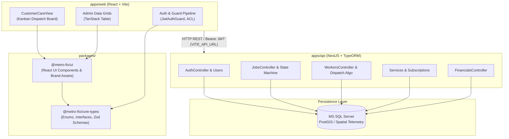
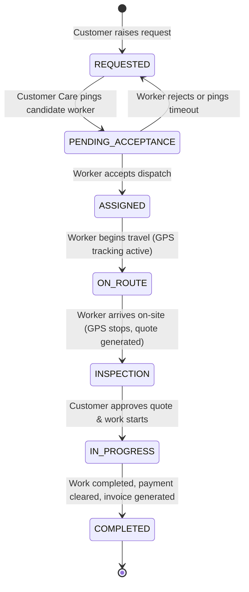

# METRO-FIX Platform: Technical Retrospective Report

**Date:** July 30, 2026  
**Repository:** `EMTEK-LK/metro-fix`  
**Scope:** `apps/web` (React/Vite Web UI), `apps/api` (NestJS REST API), MS SQL Database, and `@metro-fix/*` monorepo packages.

---

## 1. System Architecture Map

The METRO-FIX platform operates on a centralized Managed Dispatch Facility Management architecture (the "Uber-for-services" model). Centralized Customer Care dispatchers allocate field maintenance jobs to workers based on geographic proximity, availability, and internal worker quality ratings (1–5 scale).

### Monorepo Infrastructure & Package Dependencies



### Communication & Data Transfer
* **Protocol:** HTTP/1.1 REST API over JSON with `Bearer` JWT header authorization (`JwtAuthGuard`).
* **Environment-Aware Resolution:** Frontend dynamic API targeting via `API_BASE_URL` (`import.meta.env.VITE_API_URL` falling back to `http://localhost:3000`).
* **Database Connection:** NestJS `TypeOrmModule` connected to MS SQL Server with automated migrations and seeders (`npm run seed`).

### Core User Flows & State Machine



1. **Service Ticket Lifecycle:** Jobs progress through the strict 7-state lifecycle defined in `@metro-fix/core-types`.
2. **Worker Selection & Dispatch Algorithm:** Customer Care views available workers sorted by backend formula:  
   $$\text{Score} = (\text{Proximity Score} \times \text{Weight}_A) + (\text{Internal Rating} \times \text{Weight}_B)$$
3. **RBAC Security Pipeline:** 3-gate authentication flow (`AuthCheck` $\rightarrow$ `404 Check` $\rightarrow$ `RBAC ACL Check`) restricting `/admin/*` routes to `ADMIN` users while allowing `CUSTOMER_CARE` dispatch operations.

---

## 2. Technical Debt & Proposed Refactorings

| Component | MVP Solution | Technical Debt / Risk | Proposed Production Refactoring |
| :--- | :--- | :--- | :--- |
| **Frontend Routing** | Custom state-based route guard in `App.tsx` | URL deep-linking and browser history (Back/Forward) state management are minimal. | Migrate to **TanStack Router** or **React Router v6** while preserving the current ACL `ProtectedRoute` gate logic. |
| **Geospatial Processing** | Numeric `latitude`/`longitude` columns in MS SQL | Proximity sorting calculates straight-line distance instead of spatial bounding queries. | Upgrade database fields to MS SQL `GEOGRAPHY` spatial data types and use STDistance spatial queries. |
| **Data Fetching & Cache** | Raw `fetch()` calls in `useEffect` hooks | No automated background re-fetching, deduplication, or optimistic caching. | Integrate **TanStack React Query** across `CustomerCareView` and data tables for invalidation management. |
| **Realtime Messaging** | HTTP Polling fallback on status change | Dispatchers do not automatically see worker state transitions without manual screen re-fetches. | Implement NestJS `@WebSocketGateway()` with Socket.io for bidirectional updates to web board. |
| **Export Engine** | In-memory CSV formatting in NestJS controller | Large datasets could consume excessive server memory during export. | Implement streaming CSV generation using Node `Transform` streams (`fast-csv` or `json2csv`). |

---

## 3. Mobile Readiness Assessment

As we transition to building the React Native (Expo) mobile app for Field Technicians (`apps/mobile`), here is an inventory of backend readiness:

### 3.1 Readily Available API Endpoints

The existing NestJS backend provides immediate support for mobile worker authentication and status updates:

* `POST /auth/login`: Worker credential validation & JWT issuance.
* `GET /auth/profile`: Fetch worker profile information.
* `GET /jobs` & `GET /jobs/:id`: Retrieve job details, customer contact info, and site address.
* `PATCH /jobs/:id/status`: Step job status through `ASSIGNED` $\rightarrow$ `ON_ROUTE` $\rightarrow$ `INSPECTION` $\rightarrow$ `IN_PROGRESS` $\rightarrow$ `COMPLETED`.
* `GET /workers/:id`: Retrieve worker details and assigned service pillars.

### 3.2 Required Mobile-Specific API Endpoints

To support field execution in `apps/mobile`, the following 5 API endpoints must be created in `apps/api`:

```mermaid
graph LR
    subgraph Mobile App ("apps/mobile")
        M1["Worker App"]
    end

    subgraph New API Endpoints Needed ("apps/api")
        E1["GET /workers/me/jobs<br/>(Worker Assigned Queue)"]
        E2["POST /workers/me/location<br/>(GPS Telemetry Stream)"]
        E3["POST /jobs/:id/quote<br/>(On-site Inspection Quote)"]
        E4["POST /jobs/:id/proof<br/>(Completion Signatures & Photos)"]
        E5["POST /users/me/push-token<br/>(FCM Push Notifications)"]
    end

    M1 --> E1
    M1 --> E2
    M1 --> E3
    M1 --> E4
    M1 --> E5
```

1. **`GET /workers/me/jobs`**: Returns jobs assigned specifically to the logged-in worker (`assignedWorkerId = jwt.user.id`).
2. **`POST /workers/me/location`**: Accepts GPS telemetry payloads (`{ latitude, longitude, heading, speed }`) sent by `expo-location` during `ON_ROUTE` state.
3. **`POST /jobs/:id/quote`**: Submits cost & labor time estimates generated during the `INSPECTION` phase.
4. **`POST /jobs/:id/proof`**: Accepts job completion signatures and photo attachments before transitioning status to `COMPLETED`.
5. **`POST /users/me/push-token`**: Registers Expo/FCM push notification tokens for dispatch notifications (`PENDING_ACCEPTANCE`).

---

## 4. Key Takeaways & Recommended Action Items

1. **Shared Types Integration:** All new mobile DTOs and interfaces should be declared in `@metro-fix/core-types` to ensure 100% type safety between `apps/mobile` and `apps/api`.
2. **Mobile Authentication:** Re-use `@metro-fix/core-types` login schema with `react-hook-form` + Zod in `apps/mobile`.
3. **Geospatial Tracking:** Prepare NestJS `WorkersModule` to process mobile GPS pings and update worker coordinates in real time.
